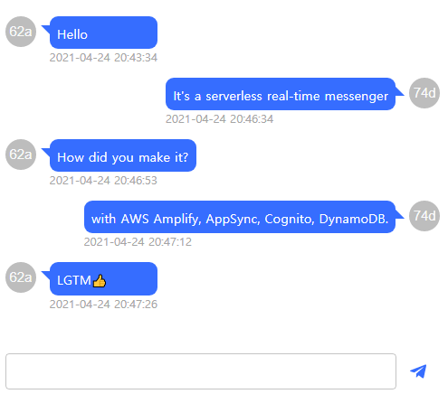

# aws-appsync-hooks-chat
<p align="center">
    <span>Realtime chat app with AWS AppSync and Apollo Hooks</span>
    
</p>

## Stack

- React.ts
- AWS Amplify (AppSync, Cognito, DynamoDB)
- GraphQL
- Apollo Hooks

## Usage

1. install dependencies
   ```
   yarn install # npm install
   ```
2. configure AWS Amplify
   ```
   yarn install -g @aws-amplify/cli
   amplify configure
   amplify init
   ```
3. add Amplify API (Select GraphQL, Cognito User Pool)
   ```
   amplify add api
   ```
4. push API and Auth
   ```
   amplify push
   ```
5. start your project
   ```
   yarn start # npm run start
   ```

## Customize
- AppSync GraphQL Schema
  - Located in `amplify/backend/api/PROJECT_NAME/schema.graphql`

- Chat messenger component
  > I wanted to apply [React Web Gifted Chat](https://github.com/johniak/react-web-gifted-chat), but it was not applied to the latest react, so I made it myself.
  - Located in `src/components/GenieChat`
  - customize your styles at `style.ts`

- Pages (Router)
  - react-router-dom is defined at `src/App.tsx`
  - Chat, Room page components are located in `src/pages`